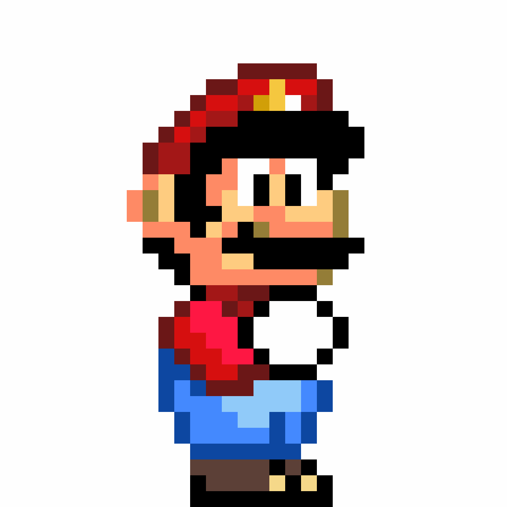

<!-- Animated Header with Modern Design -->

  

<!-- Quick Bio & Stats Summary -->

  
<i>💡 Combinando inovação tecnológica com sustentabilidade energética 💡</i>

  
  
  
  <!-- Social Media Badges Updated -->
  

    
    
    
  

<!-- Personal Avatar/Logo with Better Styling -->

  

<!-- About Me Section Enhanced -->
##  Sobre Mim

> 👨‍💻 **Desenvolvedor FrontEmd** | 🔋 **Entusiasta em Sustentabilidade** | 🌱 **Aprendiz Bosch Campinas**

Olá! Sou **Leonardo Taborda de Oliveira**, tenho 19 anos e estou baseado em Hortolândia-SP. Sou apaixonado por criar soluções tecnológicas que impactam positivamente o mundo. Minha trajetória única combina desenvolvimento de sistemas com conhecimentos em gestão energética, o que me permite abordar desafios tecnológicos com uma perspectiva sustentável e inovadora.

### O que me move:
- Desenvolvimento de soluções tecnológicas eficientes
- Aplicação de princípios de sustentabilidade em projetos
- Impacto positivo através da tecnologia

<!-- Tech Stack Section Revamped -->
##  Tech Stack

### Linguagens de Programação

### Desenvolvimento Web

### Ferramentas

### Aprendendo

<!-- Education & Experience in a More Visual Format -->
##  Formação & Experiência

<table>
  <tr>
    <td valign="top" width="50%">
      <h3>🎓 Formação Acadêmica</h3>
      <ul>
        <li>
          
          <b>Gestão de Energia e Eficiência Energética</b> 
          <i>Fatec Campinas | Em andamento</i>
        </li>
        <li>
          
          <b>Desenvolvimento de Sistemas</b> 
          <i>Senai "Roberto Mange" | Em andamento</i>
        </li>
        <li>
          
          <b>Técnico em Informática</b> integrado ao Ensino Médio 
          <i>Unasp Campus Hortolândia | Concluído</i>
        </li>
      </ul>
    </td>
    <td valign="top" width="50%">
      <h3>💼 Experiência Profissional</h3>
      <ul>
        <li>
          
          <b>Aprendiz de Soluções Digitais</b> 
          <i>Bosch Campinas | Atual</i> 
          <ul>
            <li>Desenvolvimento de soluções tecnológicas corporativas</li>
            <li>Aplicação prática de conhecimentos em ambiente profissional</li>
            <li>Colaboração em projetos de transformação digital</li>
          </ul>
        </li>
      </ul>
    </td>
  </tr>
</table>

<!-- GitHub Activity Stats Upgraded -->
##  Contribuições & Estatísticas

  

<!-- Projects Section - New Addition -->
##  Projetos Destacados

  
  

<!-- Soft Skills Section Enhanced -->
##  Soft Skills

  <table>
    <tr>
      <td align="center">
        
         Trabalho em Equipe
      </td>
      <td align="center">
        
         Soluções de Problemas
      </td>
      <td align="center">
        
         Aprendizagem Contínua
      </td>
    </tr>
    <tr>
      <td align="center">
        
         Gestão de Tempo
      </td>
      <td align="center">
        
         Comunicação
      </td>
      <td align="center">
        
         Criatividade
      </td>
    </tr>
  </table>

<!-- Future Goals Section Expanded -->
##  Objetivos

Estou determinado a me tornar um desenvolvedor Front-End e UX/UI Design. Meus principais objetivos incluem:

- 🚀 Aprofundar conhecimentos em arquiteturas modernas de software
- 🌱 Desenvolver projetos que integrem tecnologia e sustentabilidade
- 📊 Especializar-me em Design com uso de ferramentas mais profissionais
- 🌐 Contribuir para projetos open-source com impacto ambiental positivo
- 📱 Criar aplicações que incentivem práticas sustentáveis

<!-- Contact Section Revamped -->
##  Entre em Contato

  
Estou sempre aberto a novas conexões, colaborações e oportunidades de aprendizado!

  
  
  
  

<!-- Quote -->

   
  

<!-- Footer -->

  

<!-- Snake Animation -->

