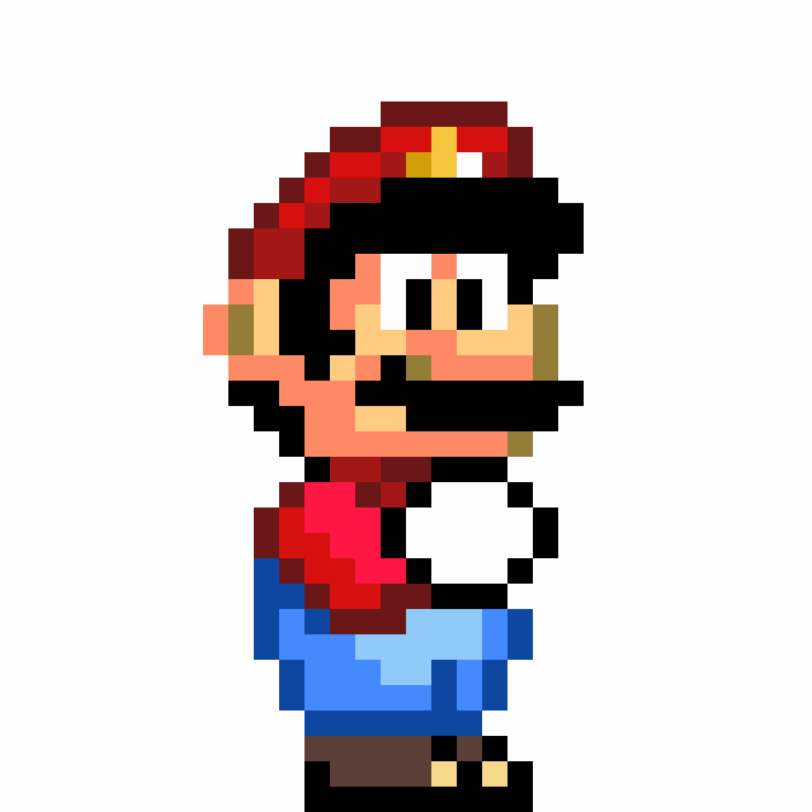

<div align="center">


<a href="https://git.io/typing-svg">
  
</a>

<br/>

<a href="https://www.linkedin.com/in/leotaborda/">
  
</a>
<a href="mailto:leo.taboorda@gmail.com">
  
</a>
<a href="https://medium.com/@leotaborda">
  
</a>
<a href="https://portifolio-leonardo-taborda-linkedi.vercel.app/">
  
</a>

<br/><br/>



</div>

## `> about_me`

I’m a **Front-End Developer and UI/UX Designer at Bosch Campinas**, focused on turning ideas into intuitive, accessible, and polished digital experiences.

I like the space where **code, design, motion, and 3D** meet — building interfaces that are not only functional, but also memorable to use.

```ts
const leotaborda = {
  location: "Campinas, SP — Brazil",
  roles: ["Front-End Developer", "UI/UX Designer", "3D Modeler"],
  learning: ["Angular", "React", "TypeScript", "Node.js"],
  exploring: ["Generative AI", "Web Animations", "Design Systems"],
  mindset: "Create. Test. Refine. Ship."
};
```

---

## `> toolbox`

<div align="center">


<br/><br/>

`Front-End` · `UI/UX` · `3D` · `Motion` · `Prototyping` · `Design Systems`

</div>

---

## `> selected_work`

<div align="center">

<a href="https://github.com/leotaborda/3d-website">
  
</a>
<a href="https://github.com/leotaborda/ARQVITA_architecture">
  
</a>

<a href="https://github.com/leotaborda/logitech_keyboard">
  
</a>
<a href="https://github.com/leotaborda/portfolio-leotaborda">
  
</a>

<br/>

<a href="https://github.com/leotaborda?tab=repositories">
  
</a>

</div>

---

## `> github_snapshot`

<div align="center">


<br/>


</div>

---

## `> contribution_mode`

<div align="center">

<picture>
  <source media="(prefers-color-scheme: dark)" srcset="https://raw.githubusercontent.com/leotaborda/leotaborda/output/github-contribution-grid-snake-dark.svg">
  <source media="(prefers-color-scheme: light)" srcset="https://raw.githubusercontent.com/leotaborda/leotaborda/output/github-contribution-grid-snake.svg">
  
</picture>

</div>

---

<div align="center">

### Let’s build something people enjoy using.

Open to conversations about **front-end, UI/UX, creative development, 3D, and technology**.

<sub>“It works on my machine.” — every developer, eventually.</sub>

<br/><br/>


</div>
